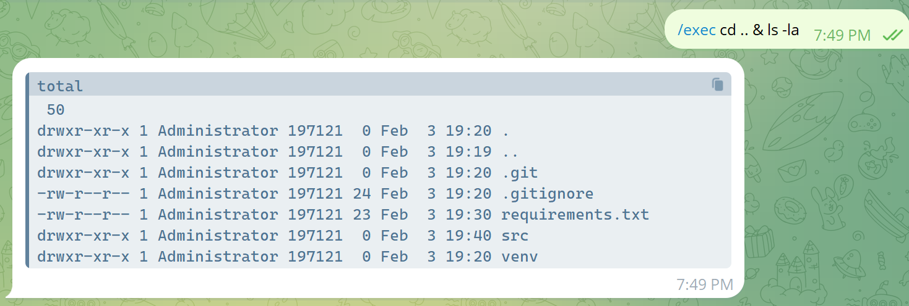

# Telegram SHH Bot

The idea of this project is to create a Telegram 
bot capable of executing Linux shell commands 
directly from the bot itself.

# Run and install   

* Set bot token in `telegram_ssh_bot/settings.py`
* Create virtual environment
* Activate virtual environment
* Install all requirements 
* Run `python3 telegram_ssh_bot`

# Example

# Plans 

* Improve bot functionality 
* Make pip package from this 